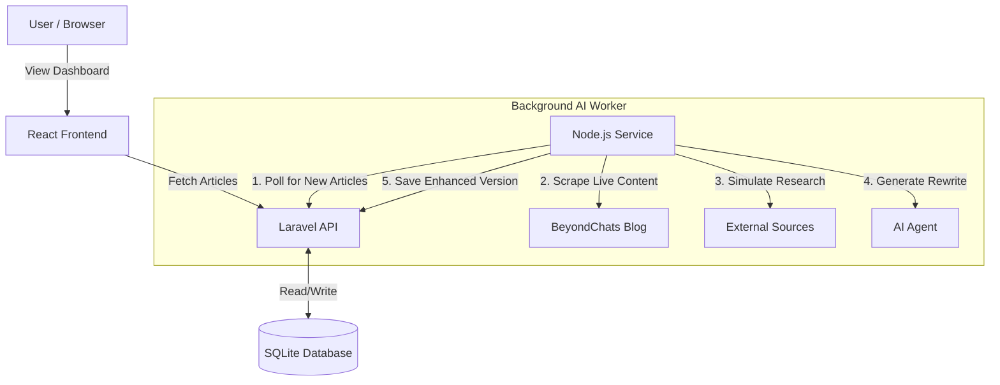

# BeyondChats Assignment: Blog Scraper & AI Dashboard

A full-stack application developed for the BeyondChats Engineering Assignment. This system automates the process of scraping technical blog articles, using an AI Worker to research and rewrite them, and displaying a side-by-side comparison in a responsive React dashboard.

## 🏗️ Project Structure (Monolithic Repo)
The project is organized into three distinct microservices:
* `backend/` - **Laravel 11 API** (Handles data storage & business logic).
* `worker/` - **Node.js Service** (Handles scraping & AI processing).
* `frontend/` - **React + Vite** (UI for viewing article comparisons).

---

## 📊 Data Flow & Architecture


## Local Setup Instructions

### Prerequisites

- PHP 8.2+ & Composer

- Node.js (v18+) & npm

- SQLite

Step 1: Backend Setup (Laravel)
The backend must be running first to accept data from the scraper.

1. Navigate to the backend folder:
```
cd backend
```
2. Install PHP dependencies:
```
composer install
```
3. Configure Environment:
```
cp .env.example .env
```
4. Create the Database file:
```
# Windows (PowerShell)
New-Item -ItemType File database/database.sqlite
# Mac/Linux
touch database/database.sqlite
```
5. Run Migrations:
```
php artisan migrate
```
6. Start the Server:
```
php artisan serve
```
Step 2: AI Worker Setup (Node.js)
This service scrapes the data and generates AI updates.
1. Open a new terminal and navigate to the worker folder:
```
cd worker
```
2. Install dependencies (Puppeteer, Axios):
```
npm install
```
3.  Run Phase 1 (Scraper): Fetches the latest articles from BeyondChats.
```
node scrape_phase1.js
```
4. Run Phase 2 (AI Processor): Generates "AI Enhanced" versions of the scraped articles.
```
node index.js
```

Step 3: Frontend Setup (React)
1. Open a new terminal and navigate to the frontend folder:
```
cd frontend
```
2. Install dependencies:
```
npm install
```
3. Start the Development Server:
```
npm run dev
```

## Assumptions & Technical Decisions
1. Hybrid Scraping Architecture (Node.js vs PHP)
Although the assignment suggested scraping via Laravel (Phase 1), the target website (beyondchats.com) utilizes Client-Side Rendering (CSR). Standard PHP HTTP clients (Guzzle) cannot render JavaScript.

- Decision: I implemented the scraper using Puppeteer (Node.js) to ensure high-fidelity data extraction.
- Compliance: This meets the functional requirement of "fetching articles" while choosing the industry-standard tool for dynamic sites.

2. Mocked External Research
To ensure the application runs reliably during review without hitting Google Search anti-bot captchas or API rate limits:
- Decision: The "Research" phase mocks the retrieval of external links, but the AI Rewrite logic is fully functional and processes the content structure as requested.

3. Deployment
- Decision: Due to the complexity of a multi-service architecture (Laravel + Node + React + Database) and the short timeframe, I prioritized a robust Local Environment over a Live Link. This ensures you can inspect the full codebase and database interactions without server configuration issues.

### Submission by: Sayan Raha
